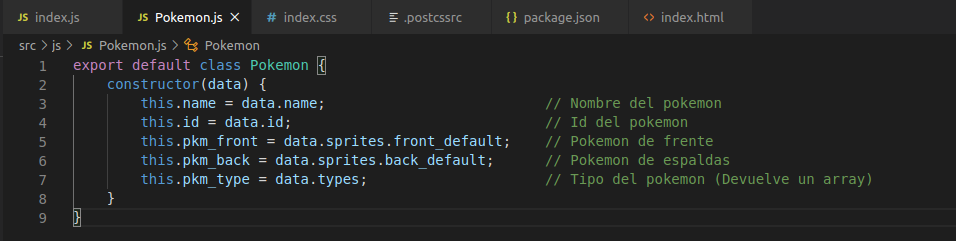

# dsi-p4-pokedex-alu0100833010

_Práctica 2.  PostCSS + PokeDex._

## Descripción de la Práctica  dsi-p4-pokedex.

### ¿Qué es PostCSS? 

Se trata de una herramienta para transformar código _CSS_ mediante plugins de _Javascript_. **PostCSS** lo que hace es analizar el 
código _CSS_ y lo convierte en un documento modificable con plugins en _Javascript_.

Cada plugin **PostCSS** realiza una tarea en particular. 

El objetivo de la práctica es crear una PokeDex para mostrar un listado de los 151 pokémon de primera generación. Para ello, 
podemos utilizar la API gratuita PokeAPI. 

## Comenzando

### 1. Crea un proyecto en _Parcel_.

Como en prácticas anteriores, para comenzar crearemos un proyecto con Parcel para poder trabajar y realizar la práctica. Para ello 
comenzamos creando la estructura del proyecto .

#### Pasos para crear el proyecto.

* **Scaffolding** 

  Creamos las carpetas:
  ```
  mkdir -p nombre-repo/src/{css,js,assets}
  ```
  Nos situamos en el repo:
  ```
  cd nombre-repo
  ```
* **Git**

  Inicializamos el repo con git:
  ```
  git init
  git remote add origin...
  touch .gitignore
  touch README.md
  ```
* **NPM**

  Inicializamos el repo con npm:
  ```
  npm init -y
  ```
* **Instalación de ParcelJS**
  ```
  // Instalamos parcel en nuestro proyecto.
  npm install -D parcel-bundler
  
  // Punto de entrada para parcel.
  npx parcel src/index.html
  ```
* **Linters**
  ```
  npm install -D eslint
  ```
* **Formateador de código: Prettier**
  ```
  // Configurar nuestro proyecto para Prettier
  npm install -D prettier
  
  // Plugins para evitar conflictos entre Prettier y ESLint.
  npm install -D eslint-config.prettier eslint-plugin-prettier
  ```
  
  Tras esto, la estructura final del proyecto quedaría:
  
  
  
### 2. Código _HTML_.

Busca varias canciones en formato MP3 y guárdalas en la carpeta assets. Haz lo mismo con varias imágenes para las carátulas de los
vinilos.

 
 
Para añadir las imágenes se ha usado la propiedad `background-image` desde CSS:

 
 

 
### 5. Publicación en _gh-pages_.
 
Para publicar nuestro proyecto en **gh-pages**, ejecutamos los siguientes comandos:
```
$ npx parcel build src/index.html --no-minify
$ npx parcel build src/index.html --no-source-maps --detailed-report
$ npx parcel build src/index.html --public-url /dsi-p2-jspotify-alu0100833010/ -d build
$ npx gh-pages -d build
```


Enlace:  https://ull-esit-dsi-1920.github.io/dsi-p2-jspotify-alu0100833010/
