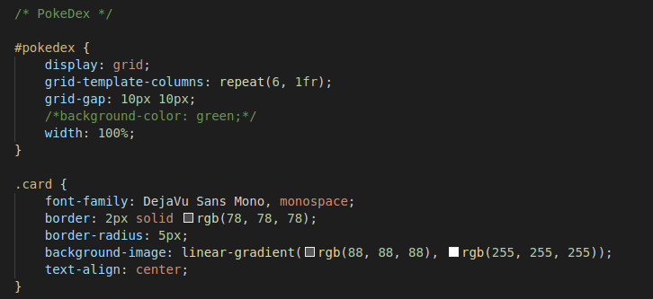
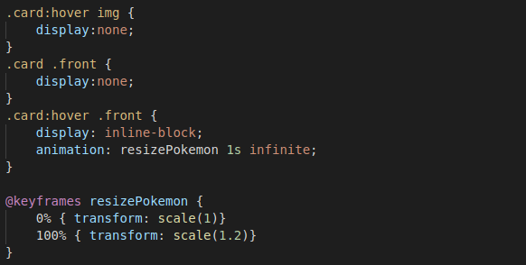
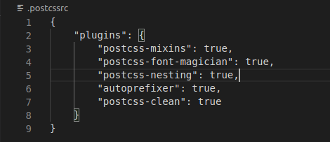
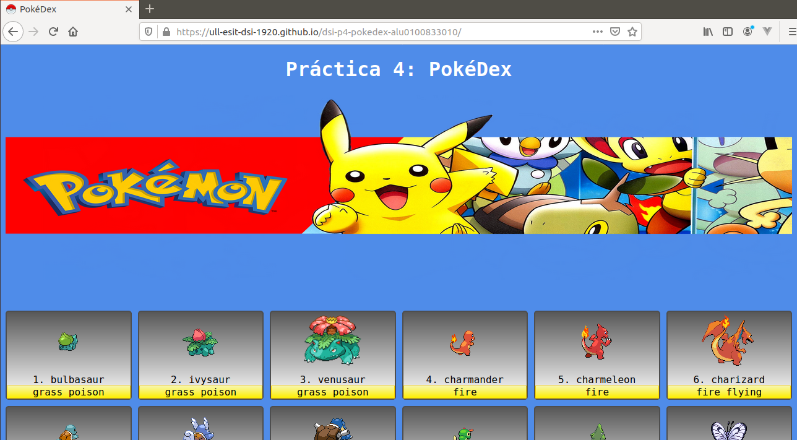

# dsi-p4-pokedex-alu0100833010

_Práctica 4.  PostCSS + PokeDex._

## Descripción de la Práctica  dsi-p4-pokedex.

### ¿Qué es PostCSS? 

Se trata de una herramienta para transformar código _CSS_ mediante plugins de _Javascript_. **PostCSS** lo que hace es analizar el 
código _CSS_ y lo convierte en un documento modificable con plugins en _Javascript_.

Cada plugin **PostCSS** realiza una tarea en particular. 

El objetivo de la práctica es crear una PokeDex para mostrar un listado de los 151 pokémon de primera generación. Para ello, 
podemos utilizar la API gratuita PokeAPI. 

## Comenzando

### 1. Crea un proyecto en _Parcel_.

Como en prácticas anteriores, para comenzar crearemos un proyecto con Parcel para poder trabajar y realizar la práctica. Para ello 
comenzamos creando la estructura del proyecto .

#### Pasos para crear el proyecto.

* **Scaffolding** 

  Creamos las carpetas:
  ```
  mkdir -p nombre-repo/src/{css,js,assets}
  ```
  Nos situamos en el repo:
  ```
  cd nombre-repo
  ```
* **Git**

  Inicializamos el repo con git:
  ```
  git init
  git remote add origin...
  touch .gitignore
  touch README.md
  ```
* **NPM**

  Inicializamos el repo con npm:
  ```
  npm init -y
  ```
* **Instalación de ParcelJS**
  ```
  // Instalamos parcel en nuestro proyecto.
  npm install -D parcel-bundler
  
  // Punto de entrada para parcel.
  npx parcel src/index.html
  ```
* **Linters**
  ```
  npm install -D eslint
  ```
* **Formateador de código: Prettier**
  ```
  // Configurar nuestro proyecto para Prettier
  npm install -D prettier
  
  // Plugins para evitar conflictos entre Prettier y ESLint.
  npm install -D eslint-config.prettier eslint-plugin-prettier
  ```
  
  Tras esto, la estructura final del proyecto quedaría:
  
  
  
### 2. Código _HTML_.

La estrucutura de `index.html` es la siguiente:

 
 
El código tiene un botón que será el encargado de, una vez se haga click sobre él, muestre los datos de nuestra PokeDex dentro del
_div_ con `id="pokedex"`.

### 3. Código _CSS_.

* **PokeDex:**

 
 
Para mostrar los elementos de nuestra **PokeDex**, se ha utilizado la propiedad `display: grid` de CSS que nos permite dividir los elementos en secciones de filas y columnas.



Por otro lado, para conseguir que los pokemons inicialmente se muestren de espaldas, y al pasar el cursor se muestren de frente y 
a su vez aumenten de tamaño, lo hacemos con uso de código _CSS_. 

La pseudo-clase `hover` nos permite realizar una determinada acción cuando el usuario pasa el cursor por encima del elemento al 
que se le está aplicando. Como cada pokemon tiene dos imágenes que corresponden al frente y a la espalda, lo hacemos de la siguiente forma:

La imagen de frente, inicialmente no se verá: 
```
.card .front {
  display: none;
}
```
Cuando el usuario pase el cursor por el elemento que contenga las imágenes del pokemon, hacemos que la imagen de espaldas no se muestre y que aparezca la frontal:

```
.card:hover img {
  display: none
}

.card:hover .front {
  display: inline-block;
}
```
Por último, para que dicha imagen aumente, utilizamos la animación `resizePokemon` en la que indicamos el tamaño inicial y final
y la añadimos en el código cuando se muestre la imagen frontal:
```
.card:hover .front {
  display: inline-block;
  animation: resizePokemon 1s infinite;
}

@keyframes resizePokemon {
  0% { transform: scale(1)}
  100% { transform: scale(1.2)}
}
```

* **PostCSS:**

Como hemos nombrado anteriormente, **PostCSS** son plugins de _Javascript_ que transforman el código _CSS_. 

Para incorporarlo a nuestro proyecto, como hacemos uso de _Parcel_, el paquete de postcss ya está incorporado, sin embargo debemos
instalar los paquetes que deseemos mediante **npm** utilizando los siguientes comandos:

```
$ npm install -D autoprefixer postcss-clean postcss-font-magician postcss-mixins postcss-nesting
```
Una vez instalados los paquetes, creamos un archivo de configuración `.postcssrc` con el siguiente contenido:

 

### 4. Código _Javascript_.


### 5. Publicación en _gh-pages_.
 
Para publicar nuestro proyecto en **gh-pages**, ejecutamos los siguientes comandos:
```
$ npx parcel build src/index.html --no-minify
$ npx parcel build src/index.html --no-source-maps --detailed-report
$ npx parcel build src/index.html --public-url /dsi-p2-jspotify-alu0100833010/ -d build
$ npx gh-pages -d build
```


Enlace:  https://ull-esit-dsi-1920.github.io/dsi-p4-pokedex-alu0100833010/
